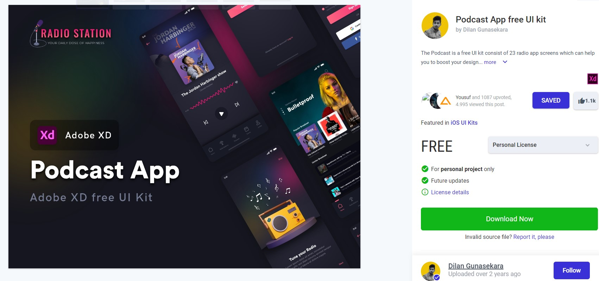
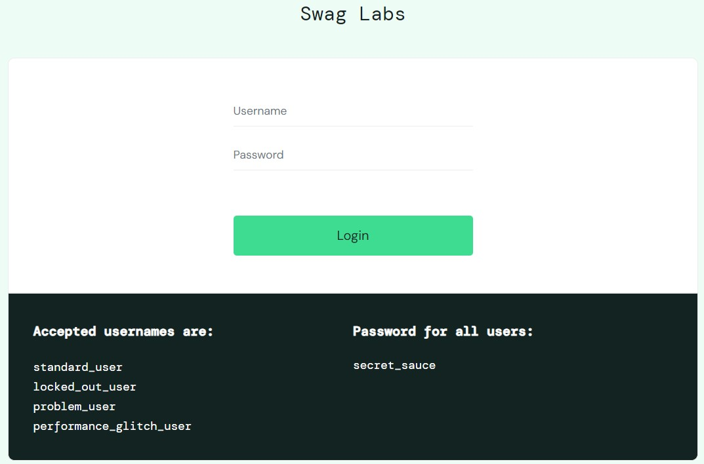

# Portfólio
    Esse projeto tem como finalidade mostrar o meu trabalho de analise de requisitos e plano de teste

Neste repositório você irá encontrar a análise de dois (2) projetos, sendo um:

- A análise de requisitos de um  protótipo Figma
- Plano de Teste de um site 

## Portfólio Análise de Requisitos

- Protótipo do Figma [PodcastApp](https://www.uplabs.com/posts/podcast-app-free-ui-kit)

## Portfólio Plano de Teste
- Site utilizado para elaboração do Plano [Saucedemo](https://www.saucedemo.com/)

